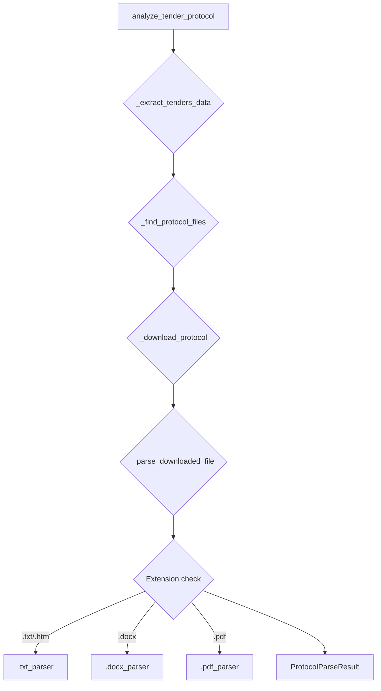
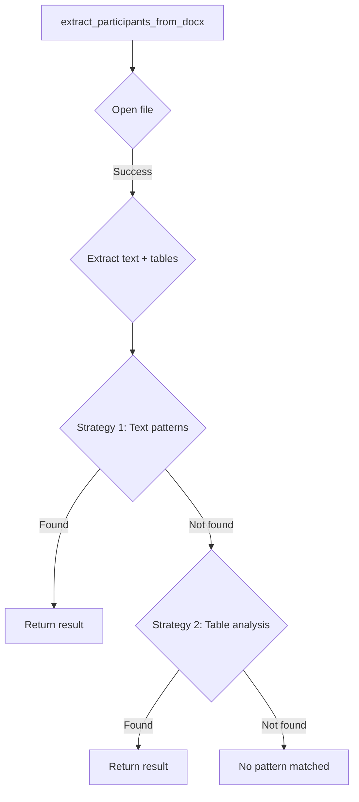
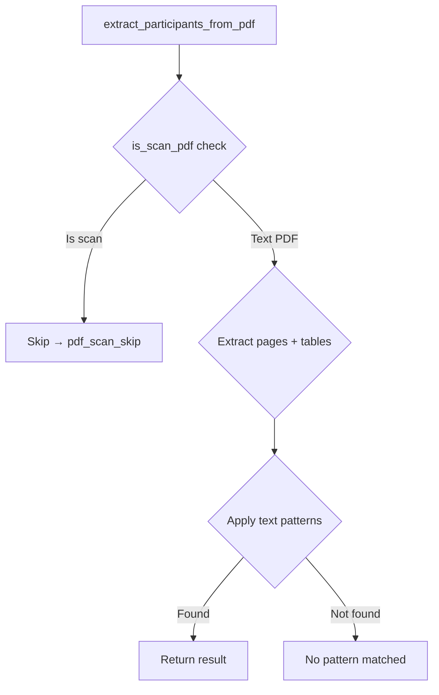
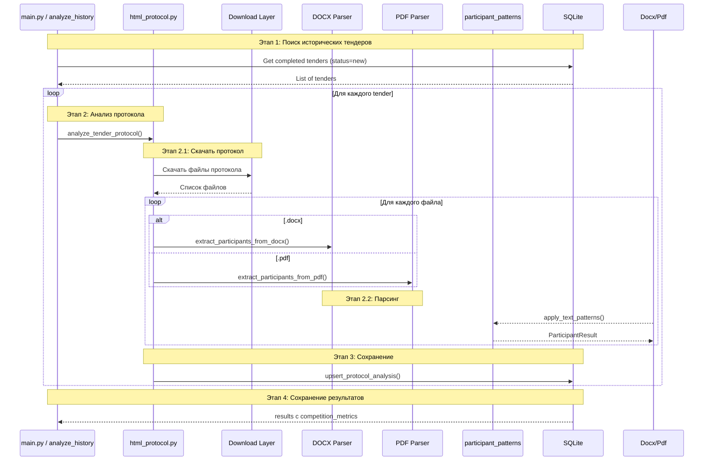
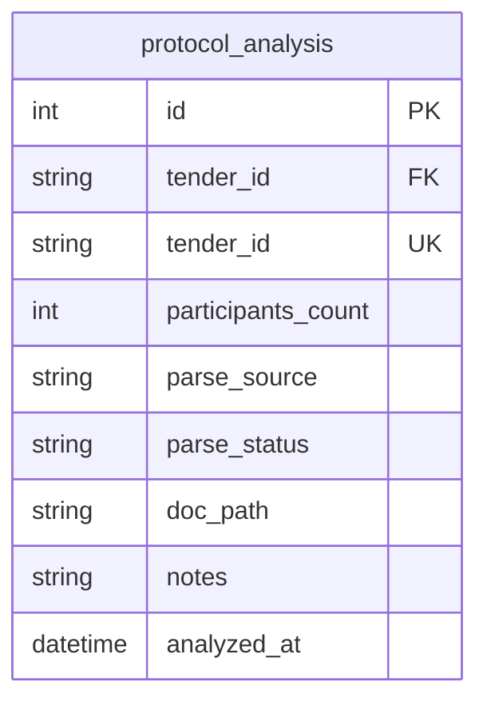
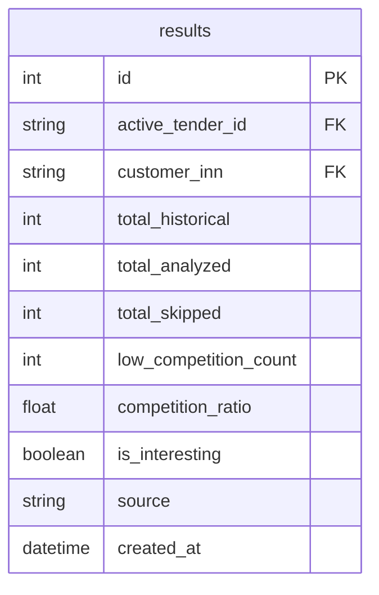

# Документация анализа протоколов Rostender Parser

## Общая архитектура системы анализа протоколов

```mermaid
flowchart TB
    subgraph Entry["📥 Входной слой"]
        html["html_protocol.py<br/>Parser Router"]
        docx["docx_parser.py<br/>DOCX parser"]
        pdf["pdf_parser.py<br/>PDF parser"]
    end
    
    subgraph Shared["🔧 Общий слой паттернов"]
        participant["participant_patterns.py<br/>Regex-паттерны"]
    end
    
    subgraph DB["💾 База данных"]
        protocol_db["protocol_analysis<br/>таблица анализа"]
    end
    
    Entry participant
    docx participant
    pdf participant
    html protocol_db
    docx protocol_db
    pdf protocol_db
```

---

## Детальная архитектура по файлам

### 1. html_protocol.py — Router для анализа протоколов



**Действия:**
1. `_extract_tenders_data(page_html, tender_id)` — парсинг JSON из `<script>`
2. `_find_protocol_files(tender_data)` — поиск протоколов в tenderData
3. `_download_protocol()` — скачивание файла
4. `_parse_downloaded_file(file_path)` — маршрутизация по расширению

---

### 2. docx_parser.py — DOCX парсинг



---

### 3. pdf_parser.py — PDF парсинг



---

### 4. participant_patterns.py — Shared regex-паттерны

```mermaid
flowchart LR
    subgraph Group1["Группа 1: Прямой счёт (HIGH)"]
        G1_1[\"Количество заявок: 3\"]
        G1_2[\"Подано 3 заявки\"]
        G1_3[\"Количество участников: 3\"]
        G1_4[\"Допущено 3 участника\"]
    end
    
    subgraph Group6["Группа 6: Нет заявок (HIGH)"]
        G6[\"Заявок не поступило\"]
    end
    
    subgraph Group5["Группа 5: Один участник (HIGH)"]
        G5[\"Единственная заявка\"]
    end
    
    subgraph Group2["Группа 2: Нумерованные заявки (MEDIUM)"]
        G2[\"Заявка №3\" → findall() → max()]
    end
    
    subgraph Group3["Группа 3: Нумерованные строки (MEDIUM)"]
        G3[\"1. ООО«Рога»\" → findall() → max()]
    end
    
    subgraph Group4["Группа 4: ИНН (LOW)"]
        G4[\"ИНН = 123\" → set() → len - 1 (заказчик)]
    end
    
    subgraph Group7["Группа 7: Несостоявшийся (LOW)"]
        G7[\"Признан Nesostoyavsh\"]
    end
    
    all_patterns["extract_participants_from_text"]
    all_patterns --> Group1
    Group1 --> G1_1
    Group1 --> G1_2
    Group1 --> G1_3
    Group1 --> G1_4
    all_patterns --> Group6
    Group6 --> G6
    all_patterns --> Group5
    Group5 --> G5
    all_patterns --> Group2
    Group2 --> G2
    all_patterns --> Group3
    Group3 --> G3
    all_patterns --> Group4
    Group4 --> G4
    all_patterns --> Group7
    Group7 --> G7
```

---

## Алгоритм работы по tender_id (текущая реализация)



---

## Детальный алгоритм паттернов (current)

```mermaid
flowchart TD
    A[extract_participants_from_text(text)] --> B{Check empty?}
    B -->|Yes| C[→ empty_text, low]
    B -->|No| D{G1: Direct count?}
    
    subgraph G1["Group 1: Direct Count (HIGH)"]
        D1["Количество заявок: N"]
        D2["Подано N заявок"]
        D3["Количество участников: N"]
        D4["Допущено N участников"]
    end
    
    subgraph G6["Group 6: Zero Applications (HIGH)"]
        G6_1["Заявок не поступило"]
        G6_2["ни одной заявки"]
        G6_3["заявки не поступало"]
    end
    
    subgraph G5["Group 5: Single Participant (HIGH)"]
        G5_1["единственная заявка"]
        G5_2["единственный участник"]
    end
    
    subgraph G2["Group 2: Numbered Applications (MEDIUM)"]
        G2_1["Заявка №1"]
        G2_2["Заявка №2"]
        G2_3["Заявка №N"]
        G2_4[findall() → max(int)]
    end
    
    subgraph G3["Group 3: Numbered Rows (MEDIUM)"]
        G3_1["1. ООО«Рога»"]
        G3_2["2. ООО«Копыта»"]
        G3_3[findall() → max(int)]
    end
    
    subgraph G4["Group 4: Unique INN (LOW)"]
        G4_1["ИНН=12345678901"]
        G4_2["ИНН=12345678902"]
        G4_3[findall() → set() → len]
        G4_4[len > 1 → -1 (заказчик)]
    end
    
    subgraph G7["Group 7: Void Tender (LOW)"]
        G7_1["Признан несостоявшимся"]
    end
    
    D -->|Yes| G1_1
    G1_1 --> D1
    D -->|Yes| G2_1
    G2_1 --> D2
    D -->|Yes| G3_1
    G3_1 --> D2
    D -->|Yes| G6_1
    G6_1 --> G6
    G6 --> C6
    D -->|Yes| G5_1
    G5_1 --> C5
    D -->|No| G2
    G2 --> G2_1
    G2_1 --> G2_2
    G2_2 --> G2_3
    G2_3 --> G2_4
    G2_4 --> C2
    G4 --> G4_1
    G4_1 --> G4_2
    G4_2 --> G4_3
    G4_3 --> G4_4
    G4_4 --> C4
    D -->|No| G7
    G7 --> G7_1
    G7_1 --> C7
    
    C1["→ count=N, high"] & C6["→ count=0, high"] & C5["→ count=1, high"] & C2["→ max, medium"] & C4["→ len-1, low"] & C7["→ count=1, low"] --> Result[ParticipantResult]
```

---

## Архитектура данных

### Таблица protocol_analysis



### Таблица results



---

## Стриминг данных по протоколам

```mermaid
flowchart LR
    subgraph Stage1["Stage 1: Поиск исторических"]
        tenders["тenders (completed)"]
    end
    
    subgraph Stage2["Stage 2: Скачивание"]
        downloads["downloads/protocols/"]
    end
    
    subgraph Stage3["Stage 3: Парсинг"]
        docx_parsers["docx_parser.py"]
        pdf_parsers["pdf_parser.py"]
        patterns["participant_patterns.py"]
    end
    
    subgraph Stage4["Stage 4: Сохранение"]
        proto_analysis["protocol_analysis"]
    end
    
    subgraph Stage5["Stage 5: Метрики"]
        results["results"]
    end
    
    tenders --> downloads
    downloads docx_parsers
    downloads pdf_parsers
    docx_parsers patterns
    pdf_parsers patterns
    patterns proto_analysis
    proto_analysis results
```

---

## Сводная таблица приоритетов паттернов

| Группа | Паттерн | Приоритет | Confidence | Пример |
|--------|---------|-----------|------------|--------|
| G1-1 | Количество заявок: N | 🟢 | high | "Количество заявок: 3" |
| G1-2 | Подано N заявок | 🟢 | high | "Подано 5 заявок" |
| G6-1 | Заявок не поступило | 🟢 | high | "заявок не поступило" |
| G5-1 | Единственная заявка | 🟡 | high | "единственная заявка" |
| G2-1 | Заявка №N | 🟡 | medium | "Заявка №3" |
| G3-1 | 1. ООО«Название» | 🟡 | medium | "3. АО «Завод»" |
| G4-1 | Уникальные ИНН | 🔴 | low | "ИНН=123..." |
| G7-1 | Несостоявшийся | 🔴 | low | "признан несостоявшимся" |

---

## Точки входа для внешних систем

### Вход 1: main.py → analyze_history → html_protocol.py

```bash
python -m src.main analyze-history
  │
  ↓
src/stages/analyze_history.py:run_analyze_history()
  │
  ↓
src/parser/html_protocol.py:analyze_tender_protocol()
  │
  ├─ → parser/docx_parser.py:extract_participants_from_docx()
  │
  └─ → parser/pdf_parser.py:extract_participants_from_pdf()
```

### Вход 2: Тесты (tests/test_docx_parser.py)

```bash
pytest tests/test_docx_parser.py
  │
  ↓
src/parser/docx_parser.py:extract_participants_from_docx()
```

### Вход 3: Unit-тесты паттернов (tests/test_parser.py)

```bash
pytest tests/test_parser.py
  │
  ↓
src/parser/participant_patterns.py:extract_participants_from_text()
```

---

## Резюме текущей архитектуры

- **Один файл протокола → один результат** (нет де-дупликации между протоколами)
- **Паттерны работают по приоритету** (G1 → G7)
- **Нумерованные паттерны (G2, G3)** считают максимум, но не дедуплицируют
- **Нет интеграции между несколькими протоколами одного tender_id**