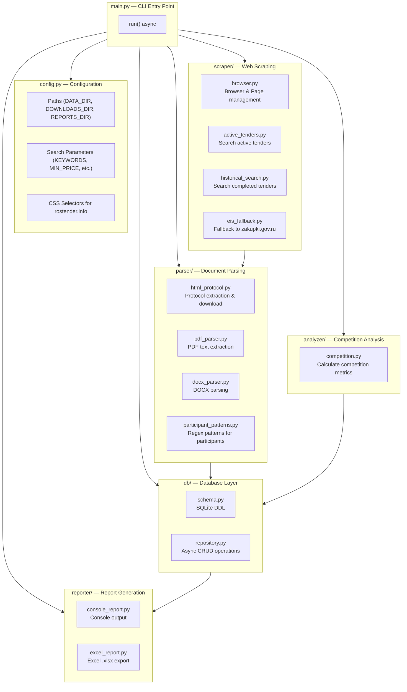
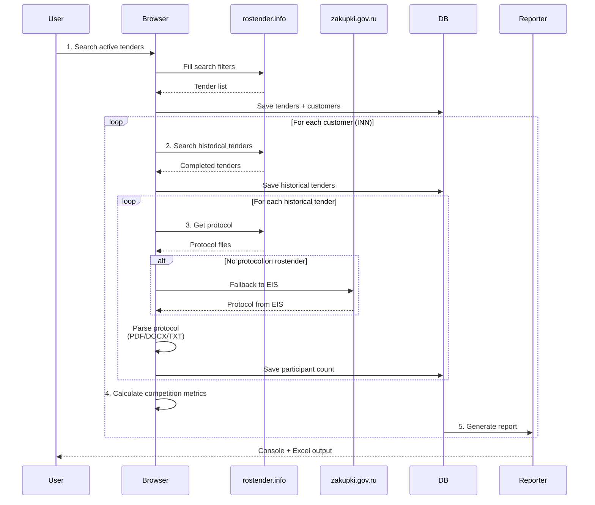
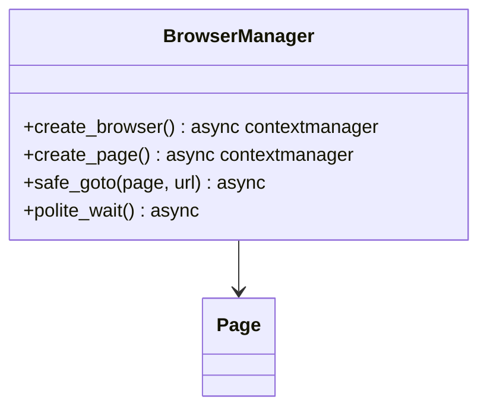
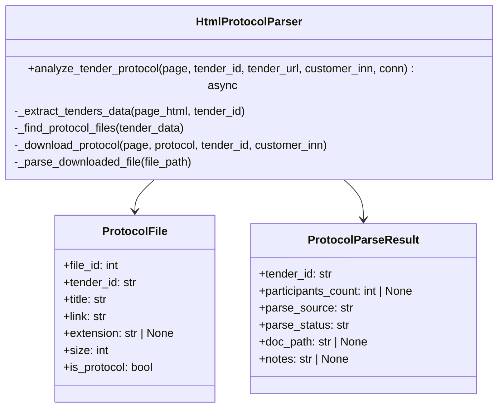
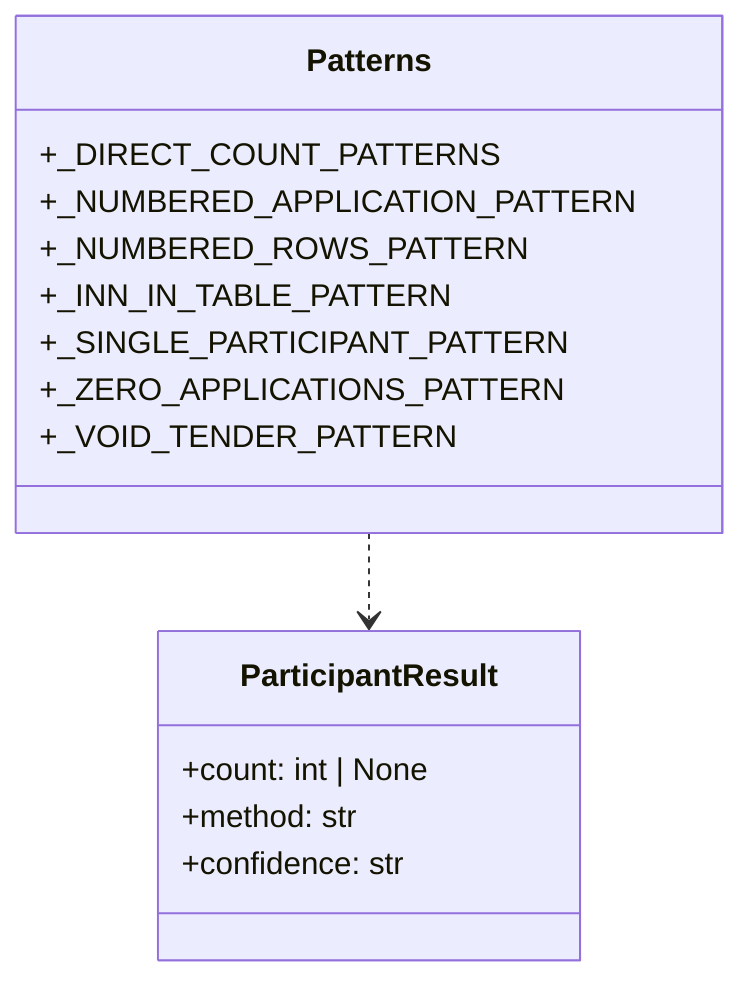
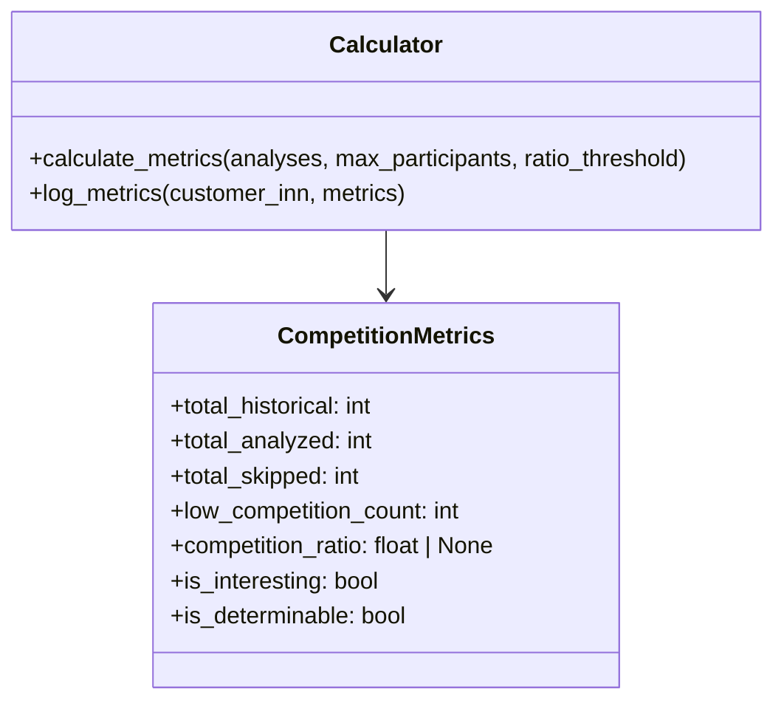
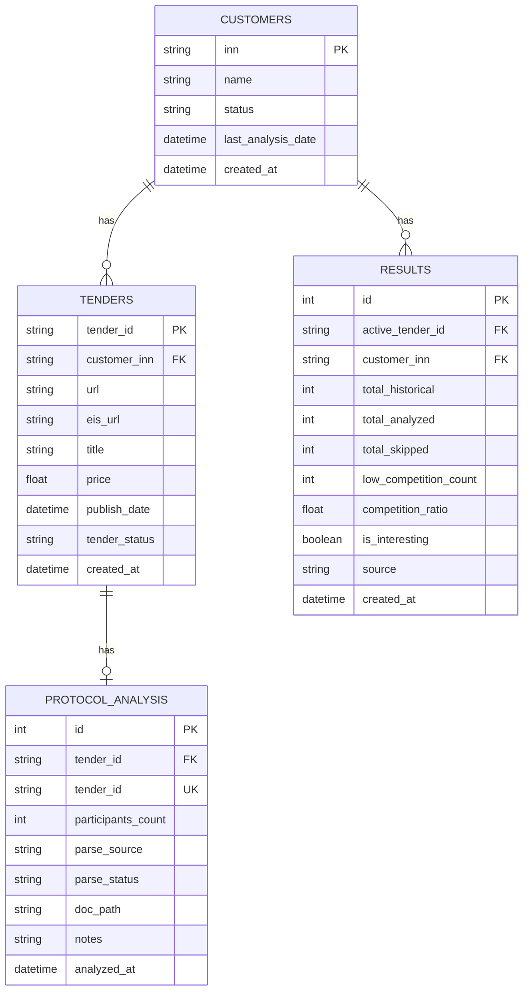
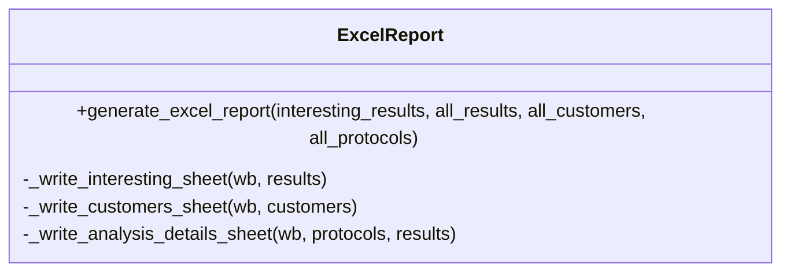
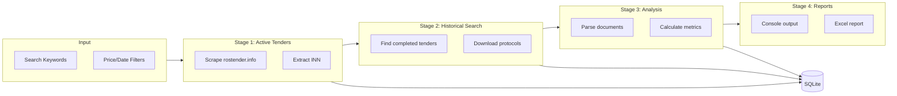

# Rostender Parser — Project Structure

## Overview

Rostender Parser — это CLI-инструмент для автоматического поиска и анализа государственных тендеров на портале rostender.info. Система находит активные тендеры, анализирует историю заказчиков и выявляет тендеры с низкой конкуренцией.

## Architecture



## Processing Pipeline



## Module Details

### `config.py` — Configuration

| Component | Description |
|-----------|-------------|
| **Paths** | `DATA_DIR`, `DOWNLOADS_DIR`, `REPORTS_DIR`, `DB_PATH` |
| **Search Keywords** | `SEARCH_KEYWORDS` — words for tender search |
| **Exclude Keywords** | `EXCLUDE_KEYWORDS` — words to exclude |
| **Price Limits** | `MIN_PRICE_ACTIVE` (25M), `MIN_PRICE_RELATED` (2M), `MIN_PRICE_HISTORICAL` (1M) |
| **Analysis Thresholds** | `MAX_PARTICIPANTS_THRESHOLD` (2), `COMPETITION_RATIO_THRESHOLD` (0.8) |
| **Selectors** | CSS selectors for rostender.info page elements |

### `scraper/` — Web Scraping

#### `browser.py`



**Functions:**
- `create_browser(headless=True)` — Launch Chromium via Playwright
- `create_page(browser)` — Create page with configured context (UA, viewport, locale)
- `safe_goto(page, url)` — Navigate with DOM wait
- `polite_wait()` — 2-second delay between requests

#### `active_tenders.py`

**Functions:**
- `search_active_tenders(page)` — Search active tenders with filters (keywords, price, date)
- `parse_tenders_on_page(page, tender_status)` — Parse tender cards from search results
- `extract_inn_from_page(page, tender_url)` — Extract customer INN from tender page
- `get_customer_name(page)` — Extract organization name
- `search_tenders_by_inn(page, inn, min_price)` — Find tenders by customer INN

#### `historical_search.py`

**Functions:**
- `search_historical_tenders(page, customer_inn, limit, custom_keywords)` — Search completed tenders
- `extract_keywords_from_title(title)` — Extract keywords from tender title for focused search

#### `eis_fallback.py`

**Functions:**
- `fallback_extract_inn(page, tender_url)` — Extract INN via zakupki.gov.ru
- `extract_inn_from_eis(page, eis_url)` — Parse INN from EIS page
- `search_historical_tenders_on_eis(page, customer_inn, limit)` — Search tenders on EIS
- `get_protocol_link_from_eis(page, tender_eis_url)` — Find protocol link on EIS
- `download_protocol_from_eis(page, protocol_url, tender_id, customer_inn)` — Download protocol file

### `parser/` — Document Parsing

#### `html_protocol.py`



**Functions:**
- `analyze_tender_protocol(page, tender_id, tender_url, customer_inn, conn)` — Main protocol analysis pipeline
- `_extract_tenders_data(page_html, tender_id)` — Extract `tendersData` JSON from JS
- `_find_protocol_files(tender_data)` — Find protocol files in tender data
- `_download_protocol(page, protocol, tender_id, customer_inn)` — Download protocol file
- `_parse_downloaded_file(file_path)` — Route to appropriate parser by extension

#### `pdf_parser.py`

**Functions:**
- `is_scan_pdf(file_path)` — Check if PDF is a scan (no text layer)
- `extract_participants_from_pdf(file_path)` — Extract participants from text PDF

#### `docx_parser.py`

**Functions:**
- `extract_participants_from_docx(file_path)` — Extract participants from DOCX
- `_analyze_tables(doc)` — Analyze tables for participant rows

#### `participant_patterns.py`



**Regex Patterns (priority order):**
1. Direct count: "Количество заявок: 3", "Подано 3 заявки"
2. Zero applications: "заявок не поступило", "ни одной заявки"
3. Single participant: "единственная заявка"
4. Numbered applications: "Заявка №3"
5. Numbered organization rows: "1. ООО «Рога и копыта»"
6. Unique INN count
7. Void tender: "признан несостоявшимся"

### `analyzer/` — Competition Analysis

#### `competition.py`



**Functions:**
- `calculate_metrics(analyses, max_participants, ratio_threshold)` — Calculate competition metrics
- `log_metrics(customer_inn, metrics)` — Log metrics to logger

**Metrics Logic:**
```
is_determinable = total_analyzed > 0
competition_ratio = low_competition_count / total_analyzed
is_interesting = competition_ratio >= ratio_threshold (0.8)
```

### `db/` — Database Layer

#### `schema.py`



**Customer Statuses:**
- `new` — Newly discovered
- `processing` — Being analyzed (historical search)
- `extended_processing` — Extended search in progress
- `extended_analyzed` — Extended analysis completed
- `analyzed` — Analysis completed
- `error` — Error during analysis

#### `repository.py`

**Database Functions:**
- `get_connection()` — Async context manager for DB connection
- `init_db()` — Create tables
- **Customers:** `upsert_customer`, `update_customer_status`, `get_customers_by_status`
- **Tenders:** `upsert_tender`, `get_tenders_by_customer`, `get_active_tenders`, `tender_exists`
- **Protocol Analysis:** `upsert_protocol_analysis`, `get_protocol_analyses_for_customer`, `get_latest_protocol_analyses`
- **Results:** `insert_result`, `get_interesting_results`, `get_interesting_customers`, `result_exists`
- **Reports:** `get_all_customers`, `get_all_results`, `get_all_protocol_analyses`

### `reporter/` — Report Generation

#### `console_report.py`

**Functions:**
- `print_console_report(interesting_results, all_results, all_customers)` — Print console report
- `log_console_summary(total_customers, total_interesting)` — Log summary to file

#### `excel_report.py`



**Excel Sheets:**
1. **Интересные тендеры** — Tenders with low competition
2. **Все заказчики** — All customers with tender counts
3. **Детали анализа** — Protocol analysis details

## Data Flow



## Usage

```bash
# Run full pipeline
python -m src.main

# Or use the module entry point
python -m src
```

## Dependencies

- **playwright** — Browser automation
- **aiosqlite** — Async SQLite
- **openpyxl** — Excel generation
- **pdfplumber** — PDF text extraction
- **python-docx** — DOCX parsing
- **loguru** — Logging
