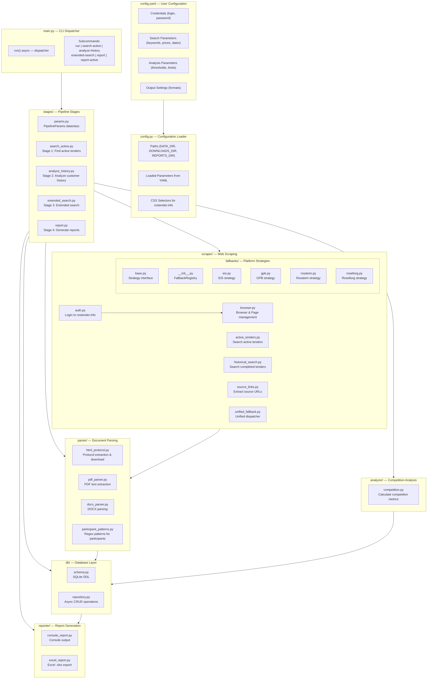
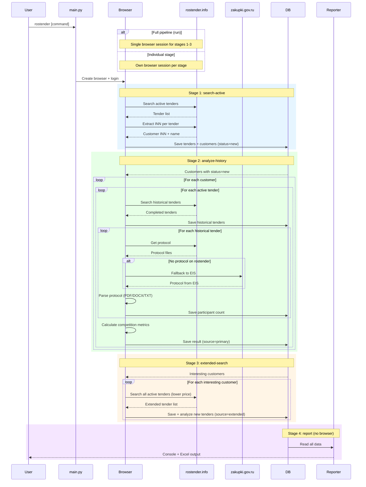
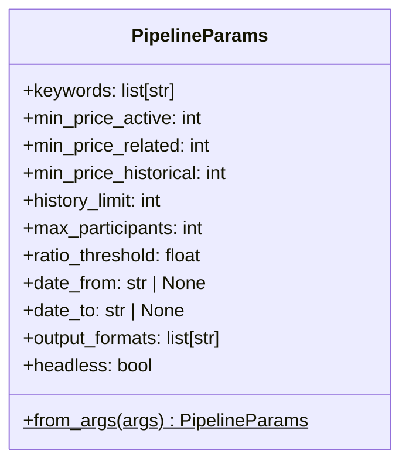
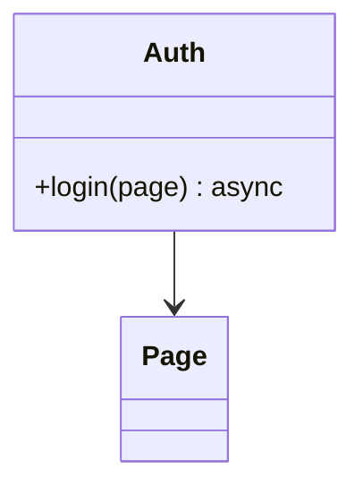
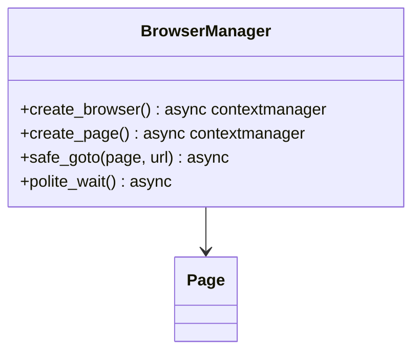
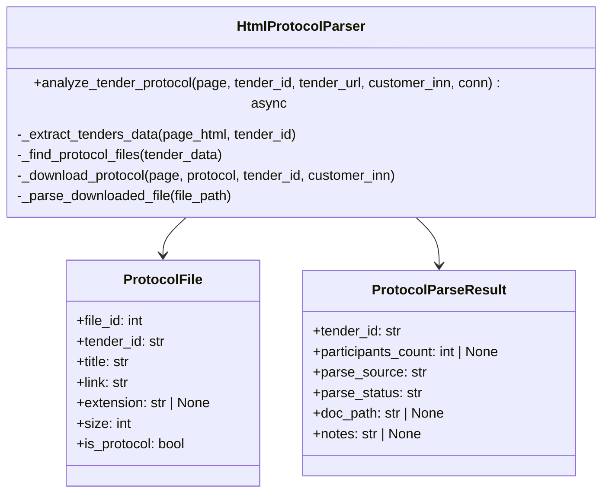
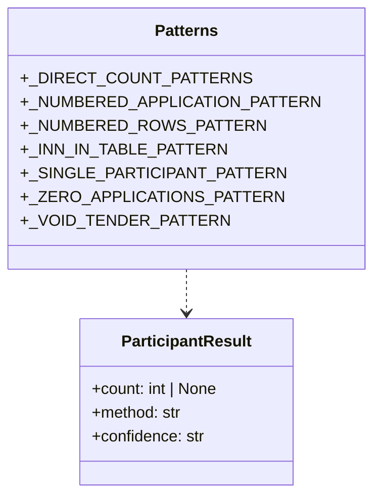
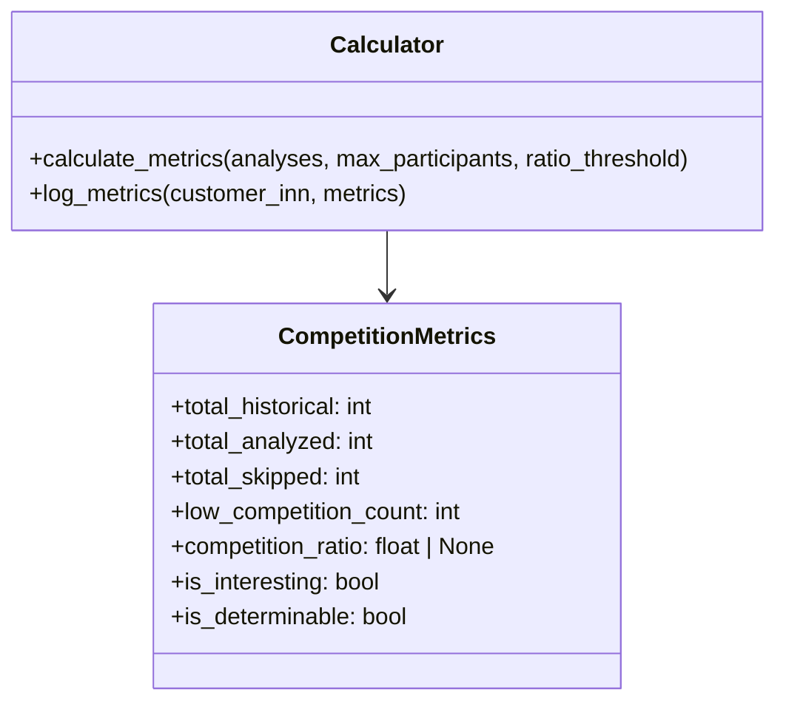
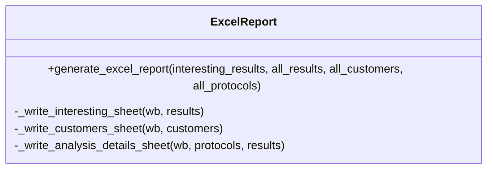

# Rostender Parser — Project Structure

## Overview

Rostender Parser — это CLI-инструмент для автоматического поиска и анализа государственных тендеров на портале rostender.info. Система авторизуется на сайте, находит активные тендеры, анализирует историю заказчиков и выявляет тендеры с низкой конкуренцией.

## Architecture



## Processing Pipeline



## Configuration

### config.yaml (User Configuration)

All user-configurable parameters are stored in `config.yaml` in the project root. The file is **not committed to git** (contains credentials). A template `config.yaml.example` is provided.

```yaml
# Authentication (required)
rostender_login: "your_login"
rostender_password: "your_password"

# Search parameters, price thresholds, analysis settings, output formats...
```

### config.py (Configuration Loader)

Loads `config.yaml` and exports typed constants for use by other modules.

| Component | Source | Description |
|-----------|--------|-------------|
| **Credentials** | YAML | `ROSTENDER_LOGIN`, `ROSTENDER_PASSWORD` (required, validated at startup) |
| **Paths** | Computed | `PROJECT_ROOT`, `DATA_DIR`, `DOWNLOADS_DIR`, `REPORTS_DIR`, `DB_PATH` |
| **Search Keywords** | YAML | `SEARCH_KEYWORDS`, `EXCLUDE_KEYWORDS` |
| **Price Limits** | YAML | `MIN_PRICE_ACTIVE` (25M), `MIN_PRICE_RELATED` (2M), `MIN_PRICE_HISTORICAL` (1M) |
| **Analysis Thresholds** | YAML | `MAX_PARTICIPANTS_THRESHOLD` (2), `COMPETITION_RATIO_THRESHOLD` (0.8) |
| **Selectors** | Python | CSS selectors for rostender.info page elements (including login form) |

**Startup validation:**
- If `config.yaml` is missing → error with instructions to copy from `config.yaml.example`
- If `rostender_login` or `rostender_password` is empty → error at startup

## Module Details

### `main.py` — CLI Dispatcher

Thin entry point (~150 lines) that:
- Parses CLI arguments with subcommands via `argparse`
- Creates `PipelineParams` from CLI args + config.yaml defaults
- Configures logging, ensures directories, initializes DB
- Dispatches to the appropriate stage(s)

For full pipeline (`rostender` / `rostender run`), all stages share a single browser session. For individual stages, each gets its own browser + login.

### `stages/` — Pipeline Stages

Each stage is an independently runnable unit. Stages communicate through the SQLite database — each reads from and writes to specific tables/statuses.

#### `params.py`



**Functions:**
- `PipelineParams.from_args(args)` — Factory that merges CLI arguments with config.yaml defaults

#### `search_active.py` — Stage 1

- `run_search_active(page, params)` — Search active tenders, extract INN (with EIS fallback), save to DB
- **DB writes:** `customers` (status=`new`), `tenders` (status=`active`)

#### `analyze_history.py` — Stage 2

- `run_analyze_history(page, params)` — For each customer with status `new`: search historical tenders, parse protocols, calculate metrics
- **DB reads:** `customers` (status=`new`), `tenders` (status=`active`)
- **DB writes:** `tenders` (status=`completed`), `protocol_analysis`, `results` (source=`primary`)

#### `extended_search.py` — Stage 3

- `run_extended_search(page, params)` — For interesting customers: find more active tenders, analyze their history
- **DB reads:** `results` (is_interesting=`true`)
- **DB writes:** `tenders`, `protocol_analysis`, `results` (source=`extended`)

#### `report.py` — Stage 4

- `run_report(params)` — Generate console + Excel reports from DB data. **No browser required.**
- `run_active_report()` — Generate Excel report specifically for active tenders.
- **DB reads:** all tables

### `scraper/` — Web Scraping

#### `auth.py`



**Functions:**
- `login(page)` — Authenticate on rostender.info. Navigates to `/login`, fills username/password from config, submits the form, verifies success by checking that `.header--notLogged` disappears. Raises `RuntimeError` on failure.

**Login form selectors:**
| Selector | Target |
|----------|--------|
| `#username` | Login/email field |
| `#password` | Password field |
| `button[name='login-button']` | Submit button |
| `.header--notLogged` | Marker for unauthenticated state |

#### `browser.py`



**Functions:**
- `create_browser(headless=True)` — Launch Chromium via Playwright
- `create_page(browser)` — Create page with configured context (UA, viewport, locale)
- `safe_goto(page, url)` — Navigate with DOM wait
- `polite_wait()` — 2-second delay between requests

**Session architecture:** For the full pipeline (`rostender run`), a single `Browser` → single `BrowserContext` → single `Page` is used for stages 1-3. Login is performed once; cookies persist across all navigation within the session. When running individual stages (`rostender search-active`, etc.), each stage creates its own browser session with a separate login.

#### `active_tenders.py`

**Functions:**
- `search_active_tenders(page)` — Search active tenders with filters (keywords, price, date)
- `parse_tenders_on_page(page, tender_status)` — Parse tender cards from search results
- `extract_inn_from_page(page, tender_url)` — Extract customer INN from tender page
- `get_customer_name(page)` — Extract organization name
- `search_tenders_by_inn(page, inn, min_price)` — Find tenders by customer INN

#### `historical_search.py`

**Functions:**
- `search_historical_tenders(page, customer_inn, limit, custom_keywords)` — Search completed tenders
- `extract_keywords_from_title(title)` — Extract keywords from tender title for focused search

#### `source_links.py`

**Functions:**
- `extract_source_urls(page)` — Extract all external source links (EIS, etc.)
- `get_source_url(source_urls, source_name)` — Extract specific source URL from string
- `parse_source_urls(source_urls)` — Parse source string into dictionary

#### `unified_fallback.py`
- `unified_fallback_extract_inn(page, source_urls_str)` — Main dispatcher that uses the `FallbackRegistry` to attempt INN extraction from available external platforms.

#### `fallbacks/` — Platform Strategies
A modular system for extracting data from external procurement platforms.
- `__init__.py` — Central `FallbackRegistry` implementation.
- `base.py` — Defines `FallbackStrategy` ABC and `@register_fallback` decorator.
- `eis.py`, `gpb.py`, `rosatom.py`, `roseltorg.py` — Platform-specific extraction logic.

### `parser/` — Document Parsing

#### `html_protocol.py`



**Functions:**
- `analyze_tender_protocol(page, tender_id, tender_url, customer_inn, conn)` — Main protocol analysis pipeline
- `_extract_tenders_data(page_html, tender_id)` — Extract `tendersData` JSON from JS
- `_find_protocol_files(tender_data)` — Find protocol files in tender data
- `_download_protocol(page, protocol, tender_id, customer_inn)` — Download protocol file
- `_parse_downloaded_file(file_path)` — Route to appropriate parser by extension

#### `pdf_parser.py`

**Functions:**
- `is_scan_pdf(file_path)` — Check if PDF is a scan (no text layer)
- `extract_participants_from_pdf(file_path)` — Extract participants from text PDF

#### `docx_parser.py`

**Functions:**
- `extract_participants_from_docx(file_path)` — Extract participants from DOCX
- `_analyze_tables(doc)` — Analyze tables for participant rows

#### `participant_patterns.py`



**Regex Patterns (priority order):**
1. Direct count: "Количество заявок: 3", "Подано 3 заявки"
2. Zero applications: "заявок не поступило", "ни одной заявки"
3. Single participant: "единственная заявка"
4. Numbered applications: "Заявка №3"
5. Numbered organization rows: "1. ООО «Рога и копыта»"
6. Unique INN count
7. Void tender: "признан несостоявшимся"

### `analyzer/` — Competition Analysis

#### `competition.py`



**Functions:**
- `calculate_metrics(analyses, max_participants, ratio_threshold)` — Calculate competition metrics
- `log_metrics(customer_inn, metrics)` — Log metrics to logger

**Metrics Logic:**
```
is_determinable = total_analyzed > 0
competition_ratio = low_competition_count / total_analyzed
is_interesting = competition_ratio >= ratio_threshold (0.8)
```

### `db/` — Database Layer

#### `schema.py`


**Customer Statuses:**
- `new` — Newly discovered
- `processing` — Being analyzed (historical search)
- `analyzed` — Analysis completed
- `extended_processing` — Extended search in progress
- `extended_analyzed` — Extended analysis completed
- `error` — Error during analysis

#### `repository.py`

**Database Functions:**
- `get_connection()` — Async context manager for DB connection
- `init_db()` — Create tables
- **Customers:** `upsert_customer`, `update_customer_status`, `get_customers_by_status`
- **Tenders:** `upsert_tender`, `get_tenders_by_customer`, `get_active_tenders`, `tender_exists`
- **Protocol Analysis:** `upsert_protocol_analysis`, `get_protocol_analyses_for_customer`, `get_latest_protocol_analyses`
- **Results:** `insert_result`, `get_interesting_results`, `get_interesting_customers`, `result_exists`
- **Reports:** `get_all_customers`, `get_all_results`, `get_all_protocol_analyses`

### `reporter/` — Report Generation

#### `console_report.py`

**Functions:**
- `print_console_report(interesting_results, all_results, all_customers)` — Print console report
- `log_console_summary(total_customers, total_interesting)` — Log summary to file

#### `excel_report.py`



**Excel Sheets:**
1. **Интересные тендеры** — Tenders with low competition
2. **Все заказчики** — All customers with tender counts
3. **Детали анализа** — Protocol analysis details

## Data Flow

```mermaid
flowchart LR
    subgraph Input
        config["config.yaml<br/>(credentials + params)"]
        cli_args["CLI Arguments<br/>(optional overrides)"]
    end

    subgraph Dispatch["main.py — Dispatcher"]
        params["PipelineParams"]
        auth["Login to rostender.info"]
    end

    subgraph Stage1["search-active"]
        scraper1["Scrape rostender.info"]
        extract1["Extract INN"]
    end

    subgraph Stage2["analyze-history"]
        scraper2["Find completed tenders"]
        download["Download & parse protocols"]
        analyze["Calculate metrics"]
    end

    subgraph Stage3["extended-search"]
        extended["Find more tenders<br/>for interesting customers"]
    end

    subgraph Stage4["report"]
        console["Console output"]
        excel["Excel report"]
    end

    Input --> Dispatch
    Dispatch --> Stage1
    Stage1 --> Stage2
    Stage2 --> Stage3
    Stage3 --> Stage4

    Stage1 <--> DB[(SQLite)]
    Stage2 <--> DB
    Stage3 <--> DB
    Stage4 --> DB
```



## File Structure

```
rostender-parse/
├── .gitignore
├── pyproject.toml            # Dependencies & entry point
├── pytest.ini                # Test configuration
├── uv.lock                   # UV lockfile
├── README.md                 # User documentation
├── STRUCTURE.md              # Architecture documentation (this file)
├── login_config_plan.md      # Implementation plan for auth & config
│
├── config.yaml.example       # Configuration template (committed to git)
├── config.yaml               # Active configuration (NOT in git, contains credentials)
│
├── data/                     # Runtime data
│   ├── rostender.db          # SQLite database
│   └── rostender.log         # Application log
│
├── downloads/                # Downloaded protocol files
│
├── reports/                  # Generated Excel reports
│
├── src/
│   ├── __init__.py
│   ├── config.py             # Configuration loader (reads config.yaml)
│   ├── main.py               # CLI dispatcher with subcommands
│   │
│   ├── stages/               # Pipeline stages (independently runnable)
│   │   ├── __init__.py
│   │   ├── params.py         # PipelineParams dataclass + factory
│   │   ├── _history_helpers.py # Shared helper for historical analysis (internal)
│   │   ├── search_active.py  # Stage 1: Search active tenders + extract INN
│   │   ├── analyze_history.py # Stage 2: Historical search + protocol parsing
│   │   ├── extended_search.py # Stage 3: Extended search for interesting customers
│   │   └── report.py         # Stage 4: Console + Excel report generation
│   │
│   ├── scraper/
│   │   ├── __init__.py
│   │   ├── auth.py           # Authentication on rostender.info
│   │   ├── browser.py        # Playwright browser lifecycle
│   │   ├── active_tenders.py # Search & parse active tenders
│   │   ├── historical_search.py  # Search completed tenders by INN
│   │   ├── source_links.py   # Extract external source URLs
│   │   └── eis_fallback.py   # Fallback to zakupki.gov.ru
│   │
│   ├── parser/
│   │   ├── __init__.py
│   │   ├── html_protocol.py  # Protocol analysis pipeline
│   │   ├── pdf_parser.py     # PDF text extraction
│   │   ├── docx_parser.py    # DOCX parsing
│   │   └── participant_patterns.py  # Shared regex patterns
│   │
│   ├── analyzer/
│   │   ├── __init__.py
│   │   └── competition.py    # Competition metrics calculation
│   │
│   ├── db/
│   │   ├── __init__.py
│   │   ├── schema.py         # SQLite DDL
│   │   └── repository.py     # Async CRUD operations
│   │
│   └── reporter/
│       ├── __init__.py
│       ├── console_report.py # Console output formatting
│       ├── excel_report.py   # Excel .xlsx generation
│       └── active_tenders_report.py # Active tenders specific Excel report
│
└── tests/
    ├── __init__.py
    ├── conftest.py                    # Fixtures: MockRow, sample data, in-memory DB
    ├── test_active_tenders.py         # Tests for scraper/active_tenders.py (parse, extract INN, search, _fill_common_filters, _submit_and_collect)
    ├── test_analyzer.py               # Tests for competition.py (calculate_metrics + log_metrics)
    ├── test_analyze_history_stage.py   # Tests for stages/analyze_history.py orchestration
    ├── test_auth.py                   # Tests for scraper/auth.py (login flow)
    ├── test_browser.py                # Tests for scraper/browser.py (safe_goto, polite_wait, create_browser/page)
    ├── test_config.py                 # Tests for config.py (paths, constants, validation)
    ├── test_console_report.py         # Tests for console_report.py
    ├── test_docx_parser.py            # Tests for parser/docx_parser.py (_analyze_tables + main fn)
    ├── test_eis_fallback.py           # Tests for scraper/eis_fallback.py (EIS INN extraction, search, protocol)
    ├── test_excel_report.py           # Tests for excel_report.py (unit + integration)
    ├── test_extended_search_stage.py  # Tests for stages/extended_search.py orchestration
    ├── test_historical_search.py      # Tests for scraper/historical_search.py (keywords + async search)
    ├── test_history_helpers.py        # Tests for stages/_history_helpers.py
    ├── test_html_protocol.py          # Tests for parser/html_protocol.py (pure functions + async protocol analysis)
    ├── test_main.py                   # Tests for main.py (CLI parsing, run dispatcher, _configure_logging, _ensure_dirs, main)
    ├── test_params.py                 # Tests for PipelineParams dataclass + factory
    ├── test_parser.py                 # Tests for participant_patterns.py
     ├── test_pdf_parser.py             # Tests for parser/pdf_parser.py (is_scan_pdf + main fn)
     ├── test_report_stage.py           # Tests for stages/report.py orchestration
     ├── test_repository.py             # Tests for repository.py (all CRUD + get_connection, init_db)
     ├── test_search_active_stage.py    # Tests for stages/search_active.py orchestration
     └── test_source_links.py           # Tests for source_links.py


```

## Dependencies

- **playwright** — Browser automation (headless Chromium)
- **aiosqlite** — Async SQLite
- **openpyxl** — Excel generation
- **pdfplumber** — PDF text extraction
- **python-docx** — DOCX parsing
- **loguru** — Structured logging
- **pyyaml** — YAML configuration loading

## Usage

```bash
# First-time setup
cp config.yaml.example config.yaml
# Edit config.yaml: fill in rostender_login and rostender_password

# Run full pipeline (all stages 1-4, single browser session)
rostender
rostender run

# Or directly
python -m src.main

# Run individual stages
rostender search-active          # Stage 1: Search active tenders
rostender report-active          # Generate active tenders report (Stage 1 result)
rostender analyze-history        # Stage 2: Analyze customer history
rostender extended-search        # Stage 3: Extended search
rostender report                 # Stage 4: Generate report (no browser)

# Check parameters without launching browser
rostender --dry-run

# Override config values via CLI (works with any subcommand)
rostender --keywords Поставка Оборудование --min-price 10000000 --days-back 14
rostender search-active -k Поставка --min-price 10000000
rostender report                 # Generate report from existing DB data

# Show browser window for debugging (default: headless)
rostender --no-headless
rostender search-active --no-headless
```
