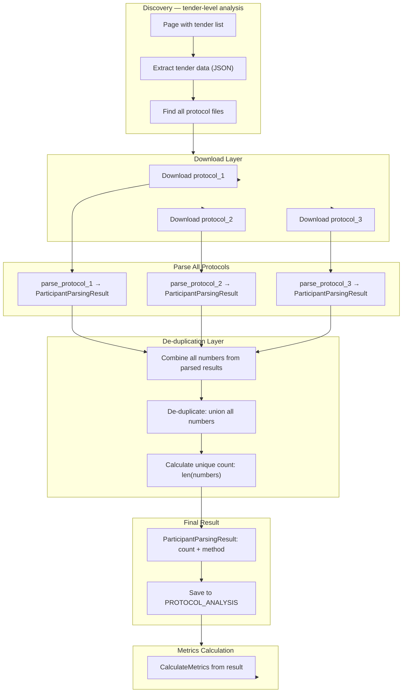

# План рефакторинга анализа протоколов

## Текущая проблема

При анализе протоколов возникают проблемы с определением уникальности заявок:
- Для одного тендера может быть несколько протоколов в разных таблицах
- В разных таблицах перечислены заявки с одним и тем же номером (это одна заявка)
- **Нужно правильно определять/дедуплицировать номера и подсчитать количество УНИКАЛЬНЫХ заявок**

## Детальный анализ текущей реализации

### 1. Протокол анализа (html_protocol.py)

```
analyze_tender_protocol(page, tender_id, tender_url, customer_inn, conn)
    ├── _extract_tenders_data(page_html, tender_id)          # JSON из JS
    ├── _find_protocol_files(tender_data)                    # Найти файлы протокола
    ├── _download_protocol(page, protocol, ...)              # Скачать
    └── _parse_downloaded_file(file_path)                    # Маршрут к парсеру
        └── _parse_downloaded_file(file_path):
            ├── if .txt/.htm/.html → extract_participants_from_text()
            ├── if .docx → extract_participants_from_docx()
            └── if .pdf → extract_participants_from_pdf()
```

**Вывод:** Один tender_id → может быть несколько PROTOCOL_ANALYSIS записей (один на каждый протокол).

---

### 2. DOCX парсинг (docx_parser.py)

```
extract_participants_from_docx(file_path)
    └── Strategy 1: text extraction + regex patterns
        └── Strategy 2: table analysis (count participant rows)
```

**Проблема:** Нумерация в таблицах считает строки, но не знает, что это одна заявка.

---

### 3. PDF парсинг (pdf_parser.py)

```
extract_participants_from_pdf(file_path)
    ├── is_scan_pdf(file_path) → skip if scan
    └── extract text + tables → regex patterns
```

**Проблема:** То же самое — нумерация считается по максимуму, но нет де-дупликации.

---

### 4. Общие паттерны (participant_patterns.py)

```
extract_participants_from_text(text)
    ├── G1: Direct count → return count
    ├── P6: Zero applications → return 0
    ├── P5: Single participant → return 1
    ├── G2: Numbered applications → findall() → return MAX
    ├── G3: Numbered org rows → findall() → return MAX
    ├── G4: Unique INN count → len(set()) - 1
    └── G7: Void tender → return 1
```

**Текущее поведение для нумерации:**
- Паттерн G2: `Заявка №3`, `Заявка №2`, `Заявка №1` → считает 3 заявки
- **НО это может быть одной заявки, пронумерованной в нескольких таблицах**

**Нужное поведение:**
- `Заявка №3` в таблице 1 + `Заявка №3` в таблице 2 → считать **1** заявку

---

## Детальное описание текущих алгоритмов

### Алгоритм нумерованных заявок (G2)

**Сейчас:**
```python
numbered_matches = _NUMBERED_APPLICATION_PATTERN.findall(text)
if numbered_matches:
    max_num = max(int(n) for n in numbered_matches)
    return ParticipantResult(count=max_num, method="numbered_applications", confidence="medium")
```

**Пример из таблицы 1:**
```
Заявка №3
Заявка №2 (в других местах)
Заявка №1
```
→ **Считает 3 заявки**

**Пример из таблицы 2:**
```
Заявка №3
Заявка №2
Заявка №1
```
→ **Считает 3 заявки (но это те же 3 заявки, что и в таблице 1!)**

---

### Алгоритм нумерованных строк участников (G3)

**Сейчас:**
```python
row_matches = _NUMBERED_ROWS_PATTERN.findall(text)
if row_matches:
    max_row = max(int(n) for n in row_matches)
    return ParticipantResult(count=max_row, method="numbered_org_rows", confidence="medium")
```

**Проблема:** Те же проблемы — считает максимум, но не знает, что это одна заявка.

---

### Алгоритм уникальных ИНН (G4)

**Сейчас:**
```python
inn_matches = _INN_IN_TABLE_PATTERN.findall(text)
if inn_matches:
    unique_inns = set(inn_matches)
    count = len(unique_inns)
    if count > 1:
        count -= 1  # Заказчик
    return ParticipantResult(count=count, method="unique_inn_count", confidence="low")
```

**Потенциально работает:** Использует `set()` для де-дупликации.

---

## Детальный план изменений

### Задача 1: Изменение структуры базы данных

**Сейчас:** `PROTOCOL_ANALYSIS` — одна запись на один файл

```sql
CREATE TABLE protocol_analysis (
    id INTEGER PRIMARY KEY,
    tender_id TEXT,              -- FK → tenders
    tender_id UK,                -- UNIQUE (один протокол только один tender_id!)
    participants_count INTEGER,
    parse_source TEXT,
    parse_status TEXT,
    doc_path TEXT,
    notes TEXT,
    analyzed_at DATETIME
);
```

**Проблема:** Если у tender_id несколько протоколов, будет одна запись на первый файл, остальные теряются или перезаписываются.

**Нужно:** Добавить возможность хранить несколько протоколов на tender_id.

```sql
ALTER TABLE protocol_analysis ADD COLUMN tender_protocol_index INTEGER;
ALTER TABLE protocol_analysis ADD COLUMN protocol_file_name TEXT;
ALTER TABLE results ADD COLUMN analyzed_at DATETIME;
ALTER TABLE protocol_analysis ADD UNIQUE(tender_id, tender_protocol_index);
```

---

### Задача 2: Изменение логики парсинга

**Сейчас:** `analyze_tender_protocol()` → один файл → один результат.

**Нужно:**
1. Один tender_id может иметь несколько протоколов
2. Каждый протокол анализируется отдельно
3. В результатах де-дуплицировать заявки между таблицами

**Алгоритм для протоколов по tender_id:**

```
analyze_multiple_protocols_by_tender(tender_id, customer_inn)
    └── Для каждого protocol_analysis записи с tender_id:
        ├── Скачать протокол (если нет)
        ├── Выделить текст + таблицы
        ├── Парсить каждый протокол
        ├── Собрать все заявки из всех протоколов
        ├── Де-дуплицировать заявки по номеру
        │   └── Заявка №3 (протокол 1) + Заявка №3 (протокол 2) = 1 уникальная заявка
        ├── Подсчитать уникальное количество заявок
        └── Сохранить результат в table results
```

---

### Задача 3: Новая стратегия де-дупликации

**Сейчас:** Паттерны возвращают `count` сразу.

**Нужно:** Паттерны возвращают не только `count`, но и `all_numbers` — все найденные номера заявок для последующей де-дупликации.

**New structure:**
```python
@dataclass
class ParticipantParsingResult:
    count: int | None  # Итоговое количество (после де-дупликации)
    numbers: list[int]  # Все найденные номера заявок (для де-дупликации)
    method: str  # Описание метода
    confidence: str  # high | medium | low
```

**Пример:**
- Протокол 1: `numbers=[1, 2, 3]`
- Протокол 2: `numbers=[1, 2, 3]`
- **Итог после де-дупликации:** `count=3`, `numbers=[1, 2, 3]`

**Пример 2:**
- Протокол 1: `numbers=[1, 2, 3, 4]`
- Протокол 2: `numbers=[1, 2, 3]`
- **Итог:** `count=4`, `numbers=[1, 2, 3, 4]`

**Пример 3:**
- Таблица 1: `numbers=[1, 2, 3]`
- Таблица 2: `numbers=[2, 3, 4]`
- **Итог:** `count=4`, `numbers=[1, 2, 3, 4]` (де-дупликация)

---

### Задача 4: Изменение паттернов

**Сейчас:**
```python
if numbered_matches:
    max_num = max(int(n) for n in numbered_matches)
    return ParticipantResult(count=max_num, method="numbered_applications", confidence="medium")
```

**Нужно:**
```python
if numbered_matches:
    numbers = set(int(n) for n in numbered_matches)  # ДЕ-ДУПЛИКАЦИЯ В РЕГРЕ
    return ParticipantParsingResult(count=len(numbers), numbers=list(numbers), method="numbered_applications", confidence="medium")
```

---

### Задача 5: Новая функция для де-дупликации

```python
def deduplicate_protocol_numbers(protocol_results: list[ParticipantParsingResult]) -> ParticipantParsingResult:
    """Де-дупликация номеров заявок из нескольких протоколов.
    
    Args:
        protocol_results: Список результатов парсинга (по протоколам)
    
    Returns:
        Единый результат с уникальными номерами
    """
    all_numbers: set[int] = set()
    
    for result in protocol_results:
        if result.numbers:
            all_numbers.update(result.numbers)
    
    if all_numbers:
        return ParticipantParsingResult(
            count=len(all_numbers),
            numbers=list(all_numbers),
            method=f"deduplicated_{protocol_results[0].method if protocol_results else 'unknown'}",
            confidence="medium"
        )
    
    # Если де-дупликация не пошла в плюс — fallback на первый паттерн
    for result in protocol_results:
        if result.count is not None:
            return ParticipantResult(count=result.count, method=result.method, confidence=result.confidence)
    
    return ParticipantResult(count=None, method="no_numbers_found", confidence="low")
```

---

### Задача 6: Новая точка входа для tender_id

```python
async def analyze_protocols_for_tender(tender_id, customer_inn, conn) -> CompetitionMetrics:
    """Аналитика всех протоколов для одного tender_id.
    
    Запросы к БД:
    1. Найти все PROTOCOL_ANALYSIS записи для tender_id
    2. Для каждой записи:
       └── Скачать протокол (если нет)
       └── Парсить файл
    3. Де-дуплицировать номера между протоколами
    4. Сохранить итоговый результат
    5. Рассчитать метрики
    """
    # Получить все протоколы
    protocol_analyses = await get_protocols_for_tender(tender_id)
    
    # Парсить каждый
    parsed_results = []
    for analysis in protocol_analyses:
        result = await parse_protocol_file(analysis.doc_path, analysis.tender_id)
        parsed_results.append(result)
    
    # Де-дупликация
    deduped_result = deduplicate_protocol_numbers(parsed_results)
    
    # Сохранение
    await save_protocol_analysis_result(deduped_result, tender_id)
    
    # Метрики
    metrics = CompetitionMetrics(
        total_historical=...,
        total_analyzed=len(protocol_analyses),
        total_skipped=0,
        low_competition_count=...,
        competition_ratio=...,
        is_interesting=False,
        is_determinable=True
    )
    
    return metrics
```

---

## Приоритеты изменений

### 🐞 Критические (сделать в первую очередь):

1. **Изменить структуру DB** — добавить `tender_protocol_index` в `protocol_analysis`
2. **Создать `analyze_multiple_protocols_by_tender()`** — новая функция для анализа по tender_id
3. **Изменить `extract_participants_from_text()`** → возвращать `all_numbers`
4. **Создать `deduplicate_protocol_numbers()`** — де-дупликация между протоколами

### 📊 Важные (следующий этап):

5. **Изменить документацию STRUCTURE.md** — обновить диаграммы с учётом новой логики
6. **Изменить `html_protocol.py`** — использовать новую функцию анализа по tender_id
7. **Написать unit-тесты** для `deduplicate_protocol_numbers()`

### 🎨 Косметические (позже):

8. Улучшить логирование
9. Добавить метрики качества парсинга
10. Оптимизировать скачивание протоколов (кэш)

---

## Детальное описание изменений по файлам

### Файл 1: participant_patterns.py

#### Изменить ParticipantResult → ParticipantParsingResult

```python
@dataclass
class ParticipantParsingResult:
    count: int | None
    numbers: list[int]  # NEW
    method: str
    confidence: str
```

#### Обновить все паттерны

```python
# G1: Direct count
if match_found:
    count = int(match.group(1))
    # НЕ return ParticipantResult сразу, собираем numbers для де-дупликации
    numbers = [count]  # Для прямого счёта — один номер
    return ParticipantParsingResult(count=count, numbers=numbers, method="direct_count_applications", confidence="high")

# G6: Zero
if zero_found:
    return ParticipantParsingResult(count=0, numbers=[], method="zero_applications", confidence="high")

# G5: Single
if single_found:
    return ParticipantParsingResult(count=1, numbers=[1], method="single_participant", confidence="high")

# G2: Numbered
if numbered_matches:
    numbers = set(int(n) for n in numbered_matches)  # ДЕ-ДУПЛИКАЦИЯ ЗДЕСЬ
    return ParticipantParsingResult(count=len(numbers), numbers=list(sorted(numbers)), method="numbered_applications", confidence="medium")

# G3: Numbered rows
if row_matches:
    numbers = set(int(n) for n in row_matches)  # ДЕ-ДУПЛИКАЦИЯ
    return ParticipantParsingResult(count=len(numbers), numbers=list(sorted(numbers)), method="numbered_org_rows", confidence="medium")

# G4: INN
if inn_matches:
    unique_inns = set(inn_matches)
    count = len(unique_inns) - 1 if len(unique_inns) > 1 else 0
    numbers = []  # Для INN-метода numbers не используются
    return ParticipantParsingResult(count=count, numbers=[], method="unique_inn_count", confidence="low")

# G7: Void
if void_found:
    return ParticipantParsingResult(count=1, numbers=[1], method="void_tender", confidence="low")
```

---

### Файл 2: docx_parser.py

```python
from src.parser.participant_patterns import (
    ParticipantParsingResult,  # NEW
    extract_participants_from_text,
    deduplicate_protocol_numbers,  # NEW
)

def extract_participants_from_docx(file_path: Path) -> ParticipantParsingResult:
    """Извлекает количество участников из .docx файла.
    
    NOW: Возвращает ParticipantParsingResult с numbers для де-дупликации.
    """
    # ... existing code ...
    
    # Strategy 1: text
    result = extract_participants_from_text(full_text)
    if result.numbers:  # NEW: check numbers instead of count
        return result
    
    # Strategy 2: table
    table_result = _analyze_tables(doc)
    if table_result is not None:
        return table_result
    
    return ParticipantParsingResult(count=None, numbers=[], method="docx_no_pattern", confidence="low")


def _analyze_tables(doc) -> ParticipantParsingResult | None:
    """Анализирует таблицы .docx.
    
    NOW: Возвращает ParticipantParsingResult с numbers.
    """
    # ... existing code ...
    
    # Считаем номера, если есть
    # Пример: "1. ООО«Рога»", "2. ООО«Копыта»" → numbers=[1, 2]
    
    # ... count rows with numbers ...
    
    if data_rows > 0:
        # Extract numbers from rows if possible
        numbers_set = set()
        for row in table.rows[1:]:
            row_text = " ".join(cell.text.strip() for cell in row.cells)
            if "1." in row_text or "2." in row_text:
                # ... extract numbers ...
                pass
        
        return ParticipantParsingResult(
            count=data_rows,
            numbers=list(sorted(numbers_set)),
            method="docx_table_participant_rows",
            confidence="medium",
        )


# NEW standalone function
def deduplicate_protocol_numbers_by_tender(
    tender_id: str, 
    customer_inn: str,
    conn,
) -> ParticipantParsingResult:
    """Де-дупликация номеров заявок между несколькими протоколами для одного tender_id.
    
    Args:
        tender_id: ID тендера для поиска протоколов
        customer_inn: ИНН заказчика для фильтрации
        conn: Database connection
    
    Returns:
        ParticipantParsingResult с де-дуплицированными номерами
    """
    # Get all protocol analyses for this tender_id
    protocol_analyses = get_protocol_analyses_for_tender(tender_id, customer_inn)
    
    parsed_results = []
    for analysis in protocol_analyses:
        if analysis.parse_status == "analyzed":
            continue  # Already parsed
        
        protocol_path = analysis.doc_path
        if protocol_path and Path(protocol_path).exists():
            result = extract_participants_from_docx(Path(protocol_path))
            parsed_results.append(result)
    
    # De-duplicate
    return deduplicate_protocol_numbers(parsed_results)
```

---

### Файл 3: pdf_parser.py

```python
from src.parser.participant_patterns import (
    ParticipantParsingResult,  # NEW
    extract_participants_from_text,
    deduplicate_protocol_numbers,  # NEW
)

def extract_participants_from_pdf(file_path: Path) -> ParticipantParsingResult:
    """Извлекает количество участников из .pdf файла.
    
    NOW: Возвращает ParticipantParsingResult с numbers для де-дупликации.
    """
    # ... existing code ...
    
    # ... apply patterns ...
    
    # Pattern G2: Numbered applications
    numbered_matches = _NUMBERED_APPLICATION_PATTERN.findall(full_text)
    if numbered_matches:
        numbers = set(int(n) for n in numbered_matches)  # ДЕ-ДУПЛИКАЦИЯ
        return ParticipantParsingResult(
            count=len(numbers),
            numbers=list(sorted(numbers)),
            method="pdf_numbered_applications",
            confidence="medium",
        )
    
    return ParticipantParsingResult(count=None, numbers=[], method="pdf_no_pattern", confidence="low")
```

---

### Файл 4: html_protocol.py

```python
from src.parser.participant_patterns import (
    ParticipantParsingResult,
    deduplicate_protocol_numbers_by_tender,
)

async def analyze_tender_protocol(
    page, tender_id, tender_url, customer_inn, conn
) -> ProtocolParseResult:
    # ... existing code ...
    
    # Find protocol files
    protocol_files = _find_protocol_files(tender_data)
    
    # OLD: One result per file
    # NEW: Analyze all protocols for this tender_id
    
    if protocol_files:
        # Use the new tender-level analysis
        result = await analyze_protocols_for_tender(
            tender_id=tender_id,
            customer_inn=customer_inn,
            conn=conn
        )
    else:
        # Fallback: parse first available file
        first_file = protocol_files[0]
        protocol_path = _download_protocol(page, first_file, tender_id, customer_inn)
        text_result = extract_participants_from_text(protocol_path)
        if text_result.count is not None:
            text_result.method = f"html_{text_result.method}"
        return ProtocolParseResult(
            tender_id=tender_id,
            participants_count=text_result.count,
            parse_source="docx",
            parse_status="success",
            doc_path=protocol_path,
            notes="",
        )
    
    return ProtocolParseResult(
        tender_id=tender_id,
        participants_count=result.count,
        parse_source="tender_level",
        parse_status="success",
        doc_path="",
        notes="Analyzed multiple protocols and deduped",
    )
```

---

### Файл 5: db/repository.py

```python
# NEW: Get protocol analyses for tender_id
async def get_protocol_analyses_for_tender(
    tender_id: str, customer_inn: str
) -> list[dict]:
    """Получить все протоколы для tender_id.
    
    SELECT id, tender_id, tender_protocol_index, doc_path, parse_status 
    FROM protocol_analysis 
    WHERE tender_id = ? 
    ORDER BY tender_protocol_index
    """
    async with get_connection() as conn:
        cursor = await conn.execute(
            "SELECT id, tender_id, tender_protocol_index, doc_path, parse_status, analyzed_at FROM protocol_analysis WHERE tender_id = ?",
            (tender_id,)
        )
        return [dict(zip(["id", "tender_id", "tender_protocol_index", "doc_path", "parse_status", "analyzed_at"], row)) for row in cursor]


# NEW: Save de-duplicated result
async def save_protocol_analyses_for_tender(
    tender_id: str, customer_inn: str, result: ParticipantParsingResult
):
    """Сохранить итоговый де-дуплицированный результат для tender_id.
    
    Если результат уже есть с таким же количеством участников — пропускаем
    (для избежания дублей в результатах).
    """
    async with get_connection() as conn:
        # Check if already analyzed with same count
        existing = await conn.execute(
            """
            SELECT id, tender_id, tender_protocol_index 
            FROM protocol_analysis 
            WHERE tender_id = ? 
            AND parse_status = 'deduplicated'
            """,
            (tender_id,)
        )
        existing = existing.fetchall()
        
        if existing:
            # Already analyzed
            return
        
        # Insert new record (or update existing)
        # ...
```

---

## Итоговая диаграмма потоков с де-дупликацией



---

## Резюме изменений

| Проблема | Решение |
|----------|---------|
| Один tender_id → несколько протоколов | Новая функция `analyze_protocols_for_tender()` |
| Нумерация учитывается по максимуму | Де-дупликация `set(numbers)` в паттернах |
| `ParticipantResult` не поддерживает де-дупликацию | Новый `ParticipantParsingResult` с `numbers` |
| БД не поддерживает несколько протоколов | Добавить `tender_protocol_index` |

---

## Следующие шаги

1. Реализовать де-дупликацию в паттернах (G2, G3)
2. Создать `ParticipantParsingResult`
3. Обновить `docx_parser.py` и `pdf_parser.py`
4. Создать `deduplicate_protocol_numbers()`
5. Обновить `html_protocol.py` для tender-level анализа
6. Изменить БД (add `tender_protocol_index`)
