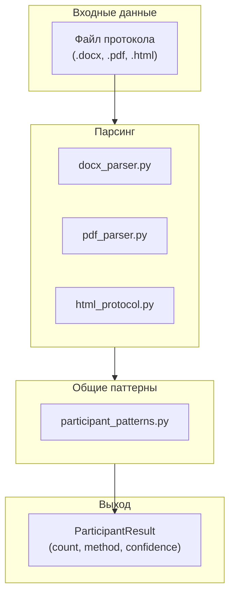
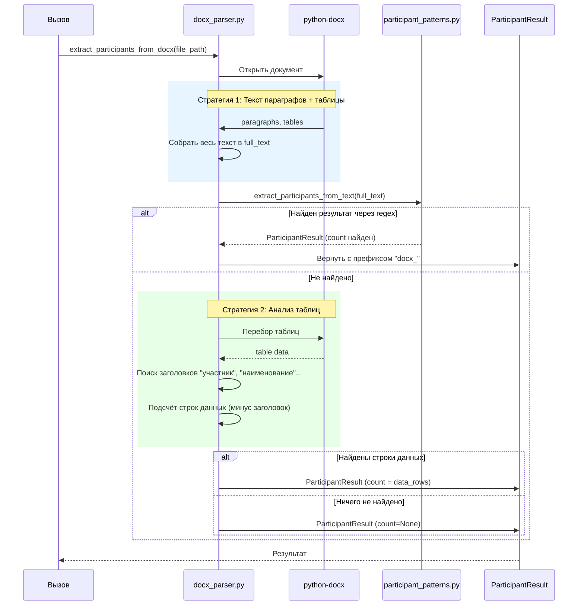
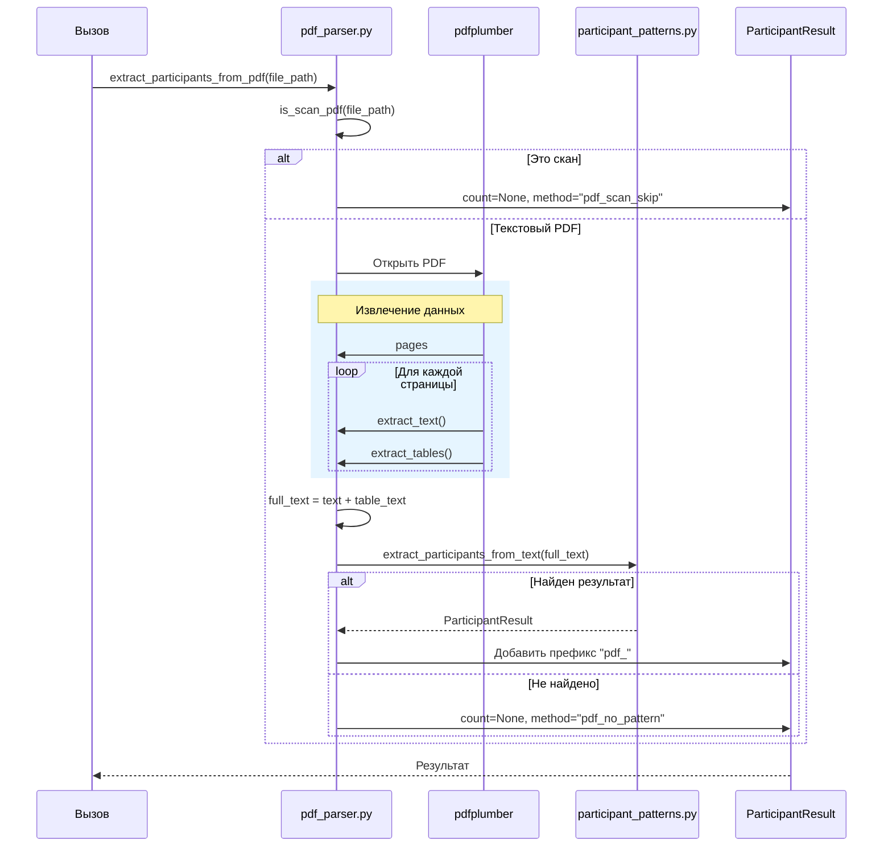
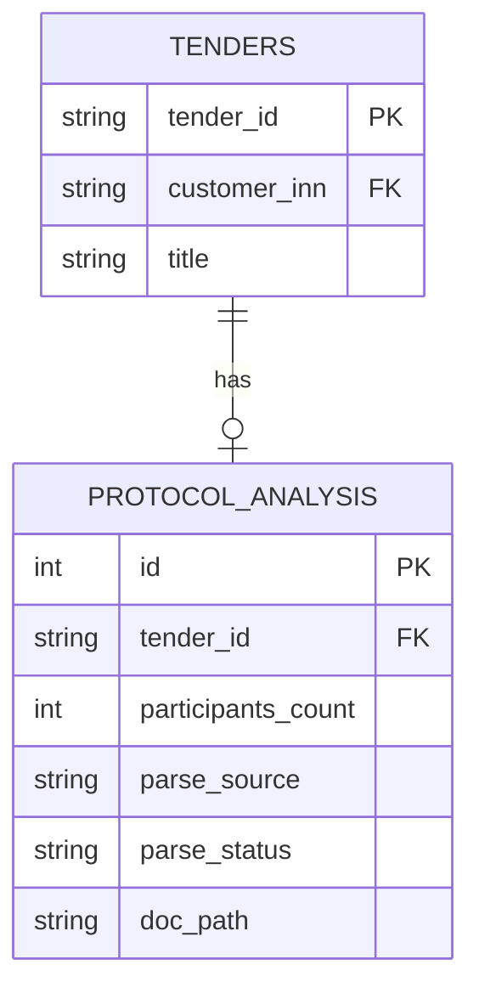

# Анализ протоколов — Текущая реализация

## Обзор

Модуль парсинга протоколов (`src/parser/`) отвечает за извлечение количества участников (поданных заявок) из файлов протоколов тендеров. Поддерживаются форматы DOCX, PDF (текстовые), а также HTML.

## Архитектура парсинга протоколов



## Поток обработки DOCX



## Поток обработки PDF



## Алгоритм поиска паттернов (participant_patterns.py)

```mermaid
flowchart TB
    start(["extract_participants_from_text(text)"]) --> check1{Текст<br/>пуст?}
    check1 -->|Да| result_empty["return count=None<br/>method=empty_text"]
    check1 -->|Нет| group1["Группа 1: Прямые указания"]
    
    group1 --> match1{Найден паттерн<br/>"Количество заявок: N"}
    match1 -->|Да| result_direct["return count=N<br/>confidence=high"]
    match1 -->|Нет| group6["Группа 6: Ноль заявок"]
    
    group6 --> match6{Паттерн<br/>"заявок не поступило"}
    match6 -->|Да| result_zero["return count=0<br/>confidence=high"]
    match6 -->|Нет| group5["Группа 5: Одна заявка"]
    
    group5 --> match5{Паттерн<br/>"единственная заявка"}
    match5 -->|Да| result_single["return count=1<br/>confidence=high"]
    match5 -->|Нет| group2["Группа 2: Нумерованные заявки"]
    
    group2 --> match2{Заявка №N<br/>в тексте}
    match2 -->|Да| result_numbered["return count=max(N)<br/>confidence=medium"]
    match2 -->|Нет| group3["Группа 3: Нумерованные строки"]
    
    group3 --> match3{1. ООО «Рога...»<br/>в тексте}
    match3 -->|Да| result_rows["return count=max(N)<br/>confidence=medium"]
    match3 -->|Нет| group4["Группа 4: Уникальные ИНН"]
    
    group4 --> match4{ИНН в тексте}
    match4 -->|Да| result_inn["return count=unique_inns-1<br/>confidence=low"]
    match4 -->|Нет| group7["Группа 7: Несостоявшийся"]
    
    group7 --> match7{Паттерн<br/>"признан несостоявш"}
    match7 -->|Да| result_void["return count=1<br/>confidence=low"]
    match7 -->|Нет| result_none["return count=None<br/>confidence=low"]
    
    result_empty --> end(["END"])
    result_direct --> end
    result_zero --> end
    result_single --> end
    result_numbered --> end
    result_rows --> end
    result_inn --> end
    result_void --> end
    result_none --> end
```

## Текущие стратегии анализа таблиц (DOCX)

```mermaid
flowchart LR
    subgraph TableAnalysis["_analyze_tables(doc)"]
        direction TB
        start["Для каждой таблицы"] --> header_check{Первая строка<br/>содержит<br/>"участник"?}
        
        header_check -->|Да| count_data["Подсчёт строк данных<br/>(все строки кроме заголовка)"]
        header_check -->|Нет| next_table["Следующая таблица"]
        
        count_data --> has_data{Строк данных<br/>> 0?}
        
        has_data -->|Да| return_result["return count=data_rows<br/>method=docx_table_participant_rows"]
        has_data -->|Нет| return_none["return None"]
    end
```

## Текущие ограничения

### 1. Игнорирование названий таблиц

Текущая реализация **не анализирует названия таблиц**. В реальных протоколах:
- Таблица может называться "Заявки участников", "Сведения о заявках", "Реестр заявок"
- Название таблицы критически важно для понимания её содержимого

### 2. Одна таблица = Одна заявка?

Текущая логика в `_analyze_tables`:
- Ищет таблицу с заголовком "участник" / "наименование"
- Считает все строки данных как отдельных участников

**Проблема:** В реальных протоколах:
- Один тендер может иметь несколько протоколов
- В разных протоколах (разных таблицах) могут быть заявки с одинаковыми номерами
- Фактически это ОДНА заявка, просто она отражена в разных документах

### 3. Отсутствие дедупликации

Нет механизма:
- Сопоставления заявок между разными протоколами одного тендера
- Уникального подсчёта заявок (одинаковый номер = один участник)

### 4. Ограниченный набор заголовков

Текущий `participant_headers`:
```python
participant_headers = {
    "участник",
    "наименование участника",
    "наименование",
    "поставщик",
    "претендент",
    "заявитель",
    "организация",
    "наименование организации",
}
```

**Проблемы:**
- Не учитывает названия типа "Сведения о заявках", "Реестр заявок", "Поданные заявки"
- Не учитывает вариации с сокращениями (напр., "Наим." вместо "Наименование")

## Пример реального протокола

```
══════════════════════════════════════════════════════════════
           ПРОТОКОЛ РАССМОТРЕНИЯ ЗАЯВОК
══════════════════════════════════════════════════════════════

Наименование заказчика: ООО "Рога и копыта"
ИНН заказчика: 1234567890

──────────────────────────────────────────────────────────────
           Таблица 1. Сведения о поданных заявках
──────────────────────────────────────────────────────────────

┌──────┬────────────────────────────┬────────────┬────────────┐
│ №    │ Наименование участника     │ ИНН        │ Дата подачи│
├──────┼────────────────────────────┼────────────┼────────────┤
│ 1    │ ООО "Поставка"             │ 9876543210 │ 10.01.2024 │
│ 2    │ АО "Торги"                 │ 1111111111 │ 11.01.2024 │
└──────┴────────────────────────────┴────────────┴────────────┘

──────────────────────────────────────────────────────────────
           Таблица 2. Результаты допуска
──────────────────────────────────────────────────────────────

┌──────┬────────────────────────────┬────────────┬────────────┐
│ №    │ Наименование участника     │ ИНН        │ Допущен    │
├──────┼────────────────────────────┼────────────┼────────────┤
│ 1    │ ООО "Поставка"             │ 9876543210 │ Да         │
│ 2    │ АО "Торги"                 │ 1111111111 │ Да         │
└──────┴────────────────────────────┴────────────┴────────────┘
```

**Что нужно извлечь:**
- 2 участника (заявки №1 и №2)
- Заявки дублируются в разных таблицах, но это ОДИН участник

## Связь с БД



## Резюме

| Компонент | Файл | Назначение |
|-----------|------|------------|
| HTML → текст | html_protocol.py | Скачивание и извлечение текста из HTML |
| DOCX парсинг | docx_parser.py | Извлечение участников из DOCX |
| PDF парсинг | pdf_parser.py | Извлечение участников из PDF |
| Паттерны | participant_patterns.py | Regex-паттерны для поиска в тексте |

**Ключевые проблемы для решения:**
1. Анализ названий таблиц для фильтрации "заявок"
2. Дедупликация заявок по номеру между таблицами/протоколами
3. Расширение списка заголовков таблиц
4. Подсчёт уникальных заявок (не строк)
